## Вопросы к экзамену ##

**Тема 1. Основные понятия и определения**

1.	Процесс управления, основные понятия и определения.
   1.	
   2.	
2.	Управление по отклонению, замкнутая система управления.
   1.	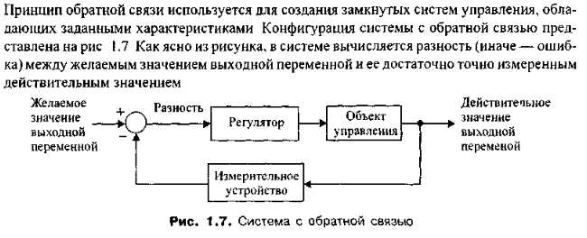
3.	Классификация систем автоматического управления.
   1.	
   2.	
   3.	
   4.	
   5.	
   6.	
4.	Функциональная схема системы автоматического управления.
   1.	

**Тема 2. Линейные системы управления**

5.	Линеаризация уравнений и систем.
   1.	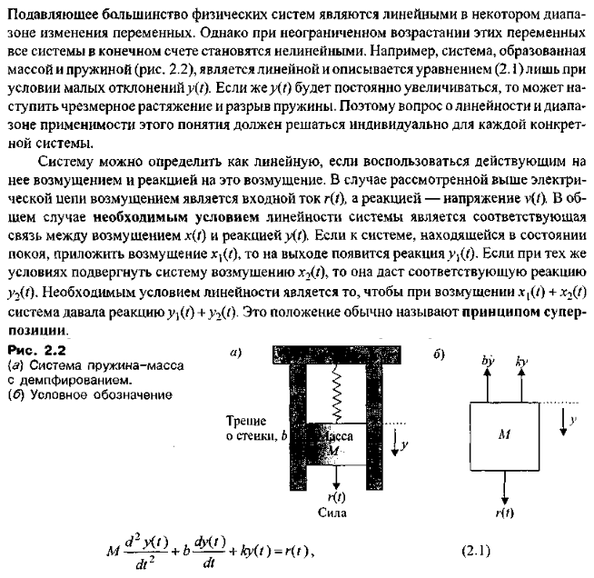
6.	Преобразование Лапласа и его основные свойства.
   1.	
7.	Определение передаточной функции системы.
   1.	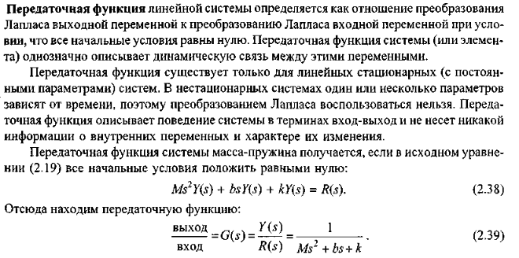
8.	Структурная схема системы, преобразование структурных схем.
   1.	
   2.	
9.	Модели в виде сигнальных графов.
   1.	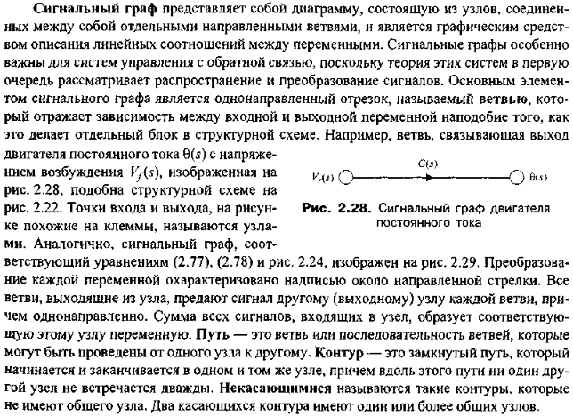
10.	Передаточные функции по управлению, по возмущению и по ошибке.
    1.	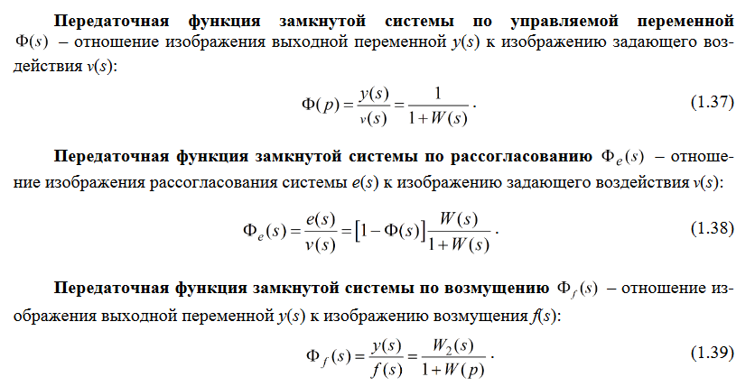
11.	Статические и астатические системы. Временные характеристики.
    1.	
    2.	
12.	Частотные характеристики систем и их графические представления.
    1.	
    2.	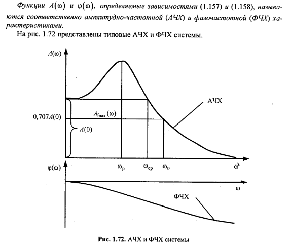
13.	Типовые звенья и их характеристики.
    1.	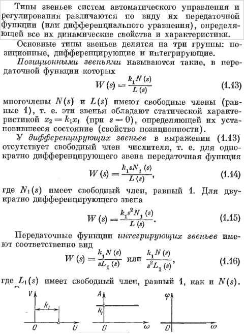

**Тема 3. Устойчивость линейных систем**

14.	Понятие устойчивости. Принцип аргумента.
    1.	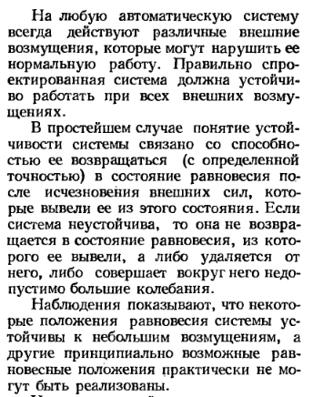
    2.	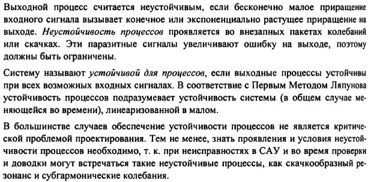
    3.	
15.	Частотные критерии Найквиста и Михайлова. Построение областей устойчивости.
    1.	
    2.	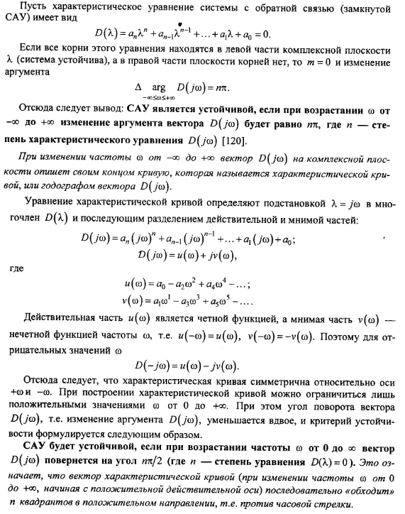
    3.	
16.	Анализ устойчивости по логарифмическим характеристикам. Запасы устойчивости.
    1.	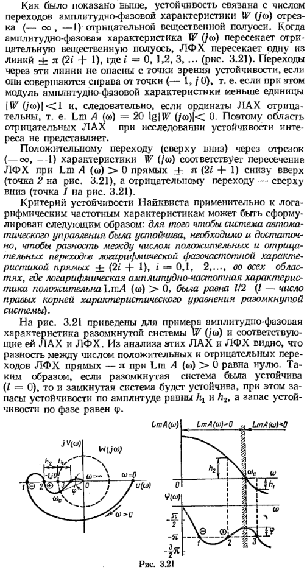
    2.	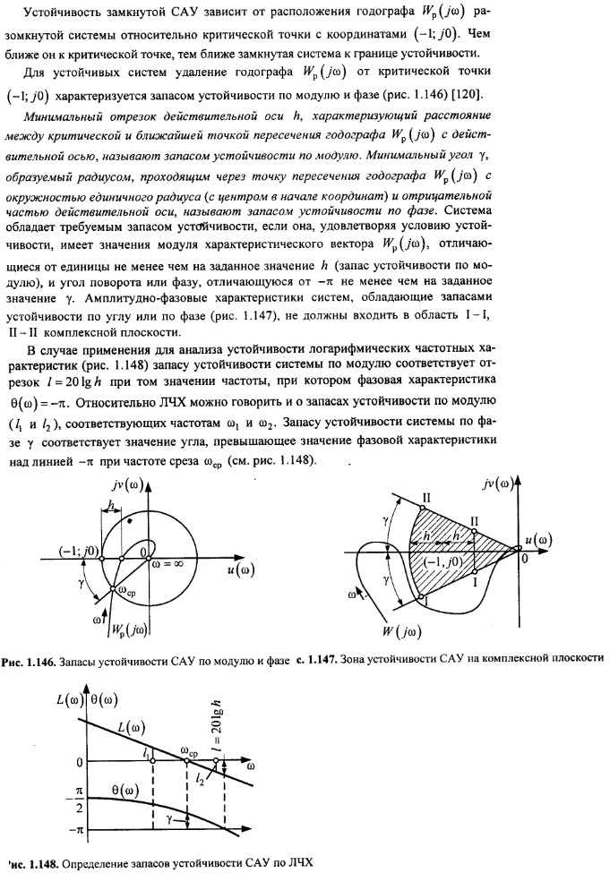
17.	Алгебраический критерий Рауса-Гурвица.
    1.	

**Тема 4. Показатели качества систем управления**

18.	Коэффициенты ошибок. Прямые показатели качества переходного процесса.
    1.	
    2.	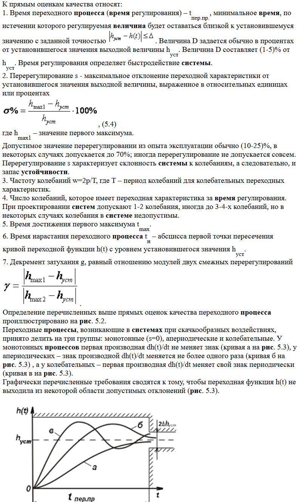
19.	Частотные, корневые и интегральные оценки качества.
    1.	
    2.	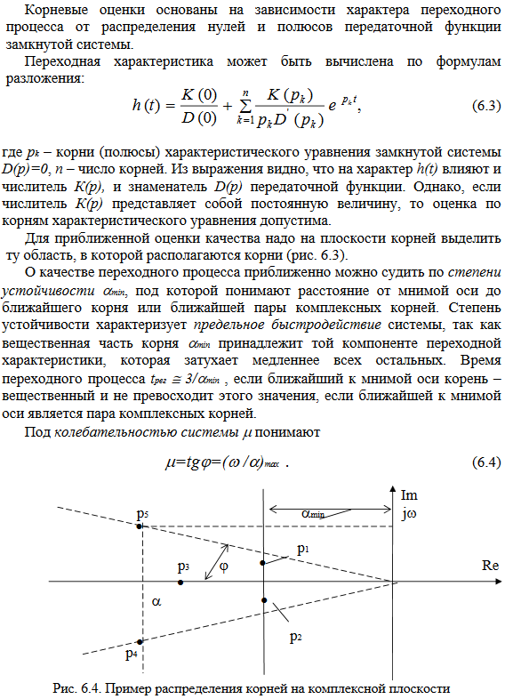
    3.	

**Тема 5. Анализ дискретных систем**

20.	Цифровые системы управления.
21.	Уравнения в конечных разностях. Z-передаточные функции.
22.	Устойчивость дискретных систем: условие устойчивости дискретной системы; w-преобразование; аналог критерия Рауса-Гурвица.

**Тема 6. Нелинейные системы управления**

23.	Нелинейные системы управления. 
24.	Типовые нелинейности.

**Тема 7. Моделирование систем управления с помощью Matlab**

25.	Передаточные функции и структурные схемы в MATLAB.
26.	Определение характеристик систем управления с помощью MATLAB.